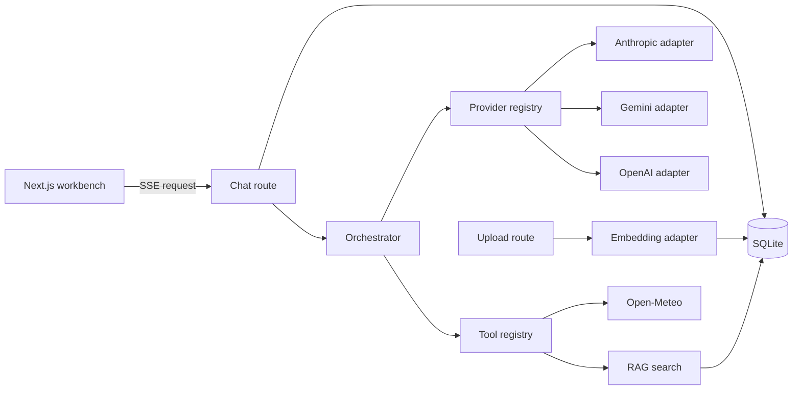

# Design

## Architecture

## Request flow

1. The chat route validates the request, stores the user message, and combines browser cancellation with a server timeout.
2. The orchestrator loads the provider-independent conversation, applies a conservative context budget, and calls the selected adapter.
3. The adapter converts messages/tools into vendor format and yields normalized text, tool-call, usage, and completion events.
4. The route forwards each event over SSE. Tool argument fragments are accumulated by call ID before execution.
5. Tools run locally. Their normalized results are appended to the internal conversation and another provider round begins. The loop supports multiple calls and up to six sequential rounds.
6. Completion stores the assistant message and metrics. Retry occurs only for rate-limit/server errors; fallback only begins before visible output has streamed.

## Provider layering

`src/contracts/ai.ts` is the boundary. Vendor roles, system-message placement, tool schemas, stream event types, error bodies, and usage fields exist only in adapter files. `src/server/config/models.ts` is the single provider catalog; `providers/index.ts`, route validation, and UI options derive from it. Adding a provider means one adapter file plus one catalog entry and no other edits.

## Decisions

1. **One Next.js process.** UI, routes, and server modules share TypeScript types and one development command. This is easier to debug live than separate frontend/backend services.
2. **Plain fetch adapters.** Official HTTP surfaces are visible in code; there is no provider abstraction framework hiding behavior.
3. **SQLite without an ORM.** The schema is small and direct SQL makes persistence easy to explain. WAL mode improves local concurrency.
4. **Small-scale vector search.** JSON vectors plus cosine similarity avoid a second service. Replace the implementation behind `searchDocuments` for production scale.
5. **Swappable embeddings.** Local, OpenAI, and Gemini implement one interface. Local is the zero-key default.
6. **SSE end to end.** The browser reads actual provider deltas. Its `AbortController` reaches the upstream fetch through the route signal.
7. **Bounded agent loop.** Six rounds prevent runaway spend while allowing sequential and multiple tool calls.
8. **Conservative context policy.** Estimate tokens at four characters each, reserve 15% for output, apply a configurable input ceiling, retain system messages, and remove oldest turns first.
9. **Strict grounded mode.** Selecting a collection retrieves before generation. Empty retrieval returns exactly `I don't know.`; successful retrieval emits chunks to the inspector and guarantees exact chunk-ID citations.

## Security posture

Implemented protections:

- API keys remain server-only and `.env*` is ignored except `.env.example`.
- Zod validates chat/search/tool inputs; uploads have extension, MIME, count, size, PDF-signature, and text-content checks.
- Provider errors are normalized and sanitized before reaching the browser.
- Calculator uses a recursive-descent arithmetic parser, never `eval`.
- Uploaded text is explicitly labeled untrusted in both system and tool descriptions.
- Request timeouts, output limits, tool-round limits, and upload limits bound cost/resource use.
- SQL statements use bound parameters.

Known gaps and production additions:

- Add authentication, authorization, tenant-scoped queries, CSRF protection, and rate limiting.
- Virus-scan uploads, sandbox PDF parsing, and add OCR separately.
- Encrypt sensitive data at rest and use a managed secret store.
- Use exact provider token counters before requests and account-level budget enforcement.
- Add audit logs, distributed tracing, durable jobs, and a production vector database.

## With more time

I would first add integration tests against provider sandboxes with recorded fixtures and exact token counting. Second, I would replace local retrieval with hybrid semantic/BM25 search plus a small grounded-answer evaluation set.
